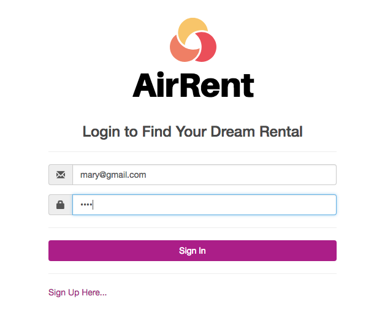
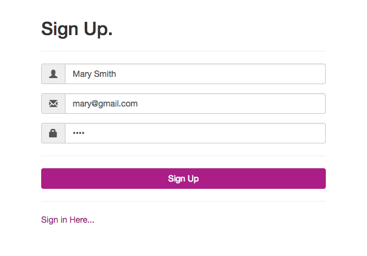
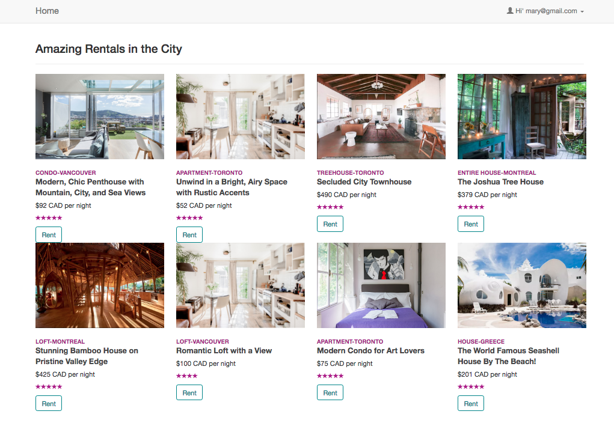
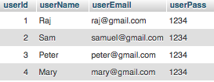
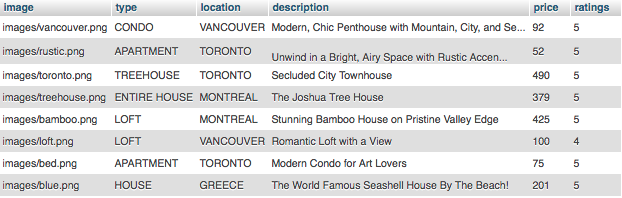
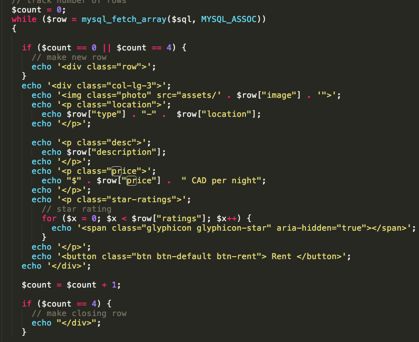

# Vacation Rental Web App

A web application for renting houses. I used: HTML/CSS, PHP, and MYSQL.
Server is XAMPP (Apache).

Login

Signup

Main Page

Database - User Table

Database - Rental Table

Main Logic (PHP)

